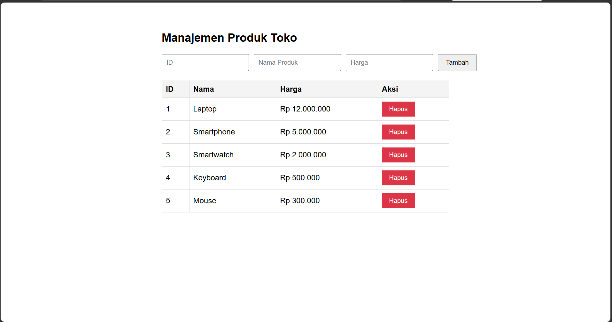

# Tugas Pertemuan 5 - CRUD Manajemen Produk

### 💡 Konsep JS yang Digunakan
- **Spread Operator & Rest Parameter (`...`)**: Menambah produk baru ke array & menangani argumen dinamis.
- **Destructuring**: Memecah array parameter `[id, nama, harga]` dan objek `{ id, nama, harga }` saat render tabel.
- **Event Handler & Delegation**: Penggunaan `e.preventDefault()` pada form dan *event delegation* untuk tombol hapus.

### Cara Menjalankan
Buka file `index.html` secara langsung di browser atau gunakan ekstensi **Live Server** di VS Code.

