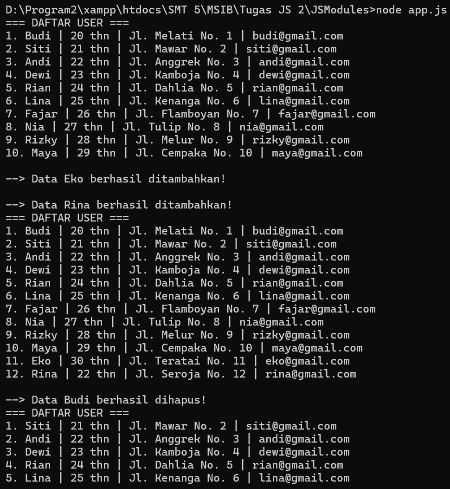

# JSModules - Tugas Pertemuan 6

Praktikum JavaScript Modules (ES6+) untuk mengelola data user sederhana (CRUD: Read, Create, Delete) menggunakan fungsi `index`, `store`, dan `destroy`.



### Cara Menjalankan
1. Buka terminal di VS Code pada folder **`JSModules`**.
2. Jalankan perintah berikut:
   ```bash
   node app.mjs